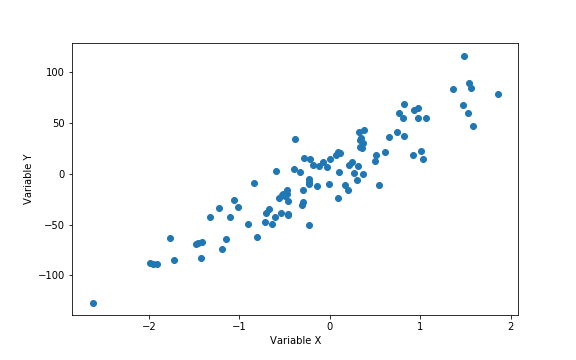

Stochastic Gradient Descent is today's standard optimization method for large-scale machine learning problems.
It is used for the training of a wide range of models, from logistic regression to artificial neural network.
In this article, we will illustrate the basic principles of gradient descent and stochastic gradient descent with 
a linear regression.

## 1. Formalizing our machine learning problem 

As you may know, Supervised machine learning consists in finding a function, called a decision function, that best modelizes the relation between input / output pairs of data. In order to find this function, we have to formulate this learning problem into an optimization problem. 

Let's consider the following task : finding the best linear function that maps the input space, the variable *X* to the output space, the variable *Y*. 

As we try to modelize the relation between *X* and *Y* by a linear function, the set of functions that the learning 
algorithm is allowed to select is the following :

$$
Y = f(X) = a \times X + b
$$

where $a,b \in \mathbb{R}$

This set of functions is our **hypothesis space**.

But how do we choose the values for the paremeters $a,b$ and how do we judge if it's a good guess or not ?

We define a function called a **loss function** that evaluates our choice in the context of the outcome Y.
We define our loss as a squared loss (we could have chosen an other loss function such as the absolute loss) :

$$
l(a,b) = (y_{i} - (a \times x_{i} +b))^2
$$

The squared loss penalizes the difference between the actual $y$ outcome and the outcome estimated by choosing 
values for the set of parameters $a,b$. This loss function evaluates our choice on a single point, but we need 
to evaluate our decision function on all the training points.

Thus, we compute the average of the square of the errors : the **mean squared error**.

$$
MSE = R_{n}(a,b) = \frac{1}{2n}\sum\limits_{i=1}^n(y_{i} - (a \times x_{i} +b))^2 
$$

where $n$ is the number of data points. 
This function, which depends on the parameters defining our hypothesis space, is called **Empirical risk**.

Eventually, we reached our initial goal : **formulating the learning problem into an optimization one !**
Indeed, all we have to do is to find the decision function, the $a,b$ coefficients, that minimize this empical risk.
It would be the best decision function we could possibly produce : our **target function**. 

Fortunately, the empirical risk function is differentiable and convex. We just have to diffentiate this function with respect to $a$ and $b$.  
$$
\frac{\partial R_{n}(a,b)}{\partial a} = \frac{1}{n}\sum\limits_{i=1}^n(x_{i} \times (a \times x_{i} + b) - y_{i})
$$

$$
\frac{\partial R_{n}(a,b)}{\partial b} = \frac{1}{n}\sum\limits_{i=1}^n( (a \times x_{i} + b) - y_{i})
$$

