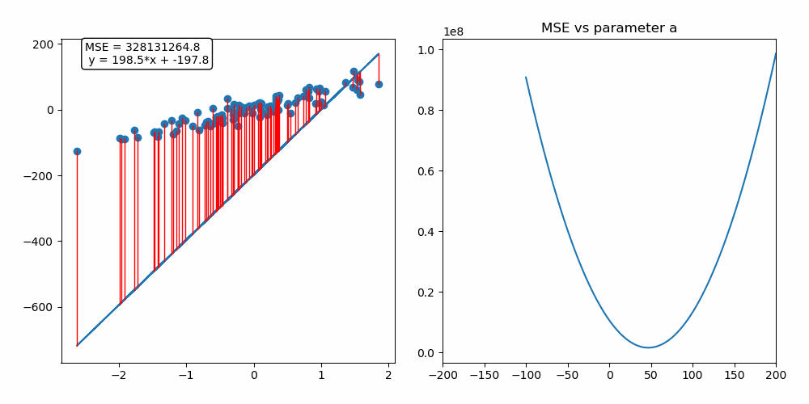

Stochastic Gradient Descent is today’s standard optimization method for large-scale machine learning problems. It is used for the training of a wide range of models, from logistic regression to artificial neural networks. In this article, we will illustrate the basic principles of gradient descent and stochastic gradient descent with linear regression.

## 1. Formalizing our machine learning problem 

As you may know, supervised machine learning consists in finding a function, called a decision function, that best models the relation between input/output pairs of data. In order to find this function, we have to formulate this learning problem into an optimization problem.

Let’s consider the following task: finding the best linear function that maps the input space, the variable *X* to the output space, the variable *Y*.

As we try to model the relation between *X* and *Y* by a linear function, the set of functions that the learning algorithm is allowed to select is the following :

$$
Y = f(X) = a \times X + b
$$

where $a,b \in \mathbb{R}$

The term $b$ is the intercept, also called **bias** in machine learning.
This set of functions is our **hypothesis space**.

But how do we choose the values for the parameters $a,b$ and how do we judge if it’s a good guess or not?
We define a function called a **loss function** that evaluates our choice in the context of the outcome *Y*.
We define our loss as a squared loss (we could have chosen another loss function such as the absolute loss):

$$
l(a,b) = (y_{i} - (a \times x_{i} +b))^2
$$

The squared loss penalizes the difference between the actual $y$ outcome and the outcome estimated by choosing values for the set of parameters $a,b$. This loss function evaluates our choice on a single point, but we need to evaluate our decision function on all the training points.

Thus, we compute the average of the square of the errors : the **mean squared error**.

$$
MSE = R_{n}(a,b) = \frac{1}{2n}\sum\limits_{i=1}^n(y_{i} - (a \times x_{i} +b))^2 
$$

where $n$ is the number of data points. 
This function, which depends on the parameters defining our hypothesis space, is called **Empirical risk**.

$R_{n}(a,b)$ is a quadratic function of the parameters, hence it's minimum always exists but may not be unique.

Eventually, we reached our initial goal: **formulating the learning problem into an optimization one!**
Indeed, all we have to do is to find the decision function, the $a,b$ coefficients, that minimize this empirical risk.
It would be the best decision function we could possibly produce: our **target function.**

In the case of a simple linear regression, we could simply differentiate the empirical risk and compute 
the $a,b$ coefficients that cancel the derivative. It is easier to use matrix notation to compute the
solution. It is convenient to include the constant variable 1 in $X$ and write parameter $a$ and $b$ as a 
single vector $ \beta=\left(\begin{array}{cc} a \\ b\end{array}\right)$.
Thus, our linear model can be written as : 

$$
Y = f(X) = X\beta
$$

with $X=\left(\begin{array}{cc} x1 & 1 \\ x2 & 1 \\ \dots & \dots\\ xn & 1\end{array}\right)$ and $ \beta=\left(\begin{array}{cc} a \\ b\end{array}\right)$.

and our loss function becomes:
$$
MSE = R_{n}(\beta) = (y-X\beta)^T(y-X\beta)
$$

The $\beta$ minimizing our equation can be found by solving the following equation: 

$$
\frac{dR_{n}(\beta)}{d\beta} = 0 \Leftrightarrow X^T(y-X\beta) = 0 \Leftrightarrow \beta = (X^TX)^{-1} X^Ty
$$

Our linear regression has only two predictors ($a$ and $b$), thus $X$ is a $n \times 2 $ matrix (where $n$ is the number of observations and 2 the number of predictors). As you can see, to solve the equation we need to calculate the matrix $X^TX$ then invert it. 

In machine learning, the number of observations is often very high as well as the number of predictors. Consequently, this operation is very expensive in terms of calculation and memory.
Gradient descent algorithm is an iterative optimization algorithm that allows us to find the solution while keeping the computational complexity low. We describe how it works in the next part of this article.

## 2. Diving into Gradient descent principle 

Gradient descent algorithm can be illustrated by the following analogy. Imagine that you are lost in the mountains in the middle of the night. You can’t see anything as it’s pitch dark and you want to go back to the village located in the valley bottom (you are trying to find the local/global minimum of the mean squared error function). To survive, you develop the following strategy:

1. At your current location, you feel the steepness of the hill and find the direction with the steepest slope. The steepest slope corresponds to the gradient of the mean squared error.
2. You follow this direction downhill and walk a fixed distance and you stop to check if you are still in the right direction. This fixed distance is the learning rate of the gradient descent algorithm. If you walk for too long, you can miss the village and end up on the slope on the other side of the valley. If you don’t walk enough, it will take a very long time to reach the village and there is a risk that you get stuck in a small hole (a local minimum).
3. You repeat those steps until a criterion you fixed is met: for instance, the difference in altitude between two steps is very low.

Eventually you will reach the valley bottom, or you will get stuck in a local minimum ... 

Now that you have understood the principle with this allegory, let’s dive into the mathematics of gradient descent algorithm!
For finding the $a,b$ parameters that minimize the mean squared error, the algorithm can be implemented as follow:

1. Initialize $a$ and $b$ values, for instance $a=200$ and $b=-200$
2. Compute the gradient of the mean squared error with respect to $a$ and $b$. The gradient is the direction of the steepest slope at the current location. 

$$
\frac{dR_{n}(a,b)}{da} = \frac{1}{n}\sum\limits_{i=1}^n(x_{i}\times (a \times x_{i} +b)-y_{i}) 
$$
$$
\frac{dR_{n}(a,b)}{db} = \frac{1}{n}\sum\limits_{i=1}^n((a \times x_{i} +b)-y_{i}) 
$$

Then update values of $a$ and $b$ by subtracting the gradient multiplied by a step size: 
$$
a = a - \eta\frac{dR_{n}(a,b)}{da}    
$$
$$
b = b - \eta\frac{dR_{n}(a,b)}{db}
$$
with $\eta$, our fixed step size.

Compute the mean squared loss with the updated values of $a$ and $b$.

3. Repeat those steps until a stopping criterion is met. For instance, the decrease of the mean squared loss is lower than a threshold $\epsilon$.

On the animation below, you can see the update of the parameter a performed by the gradient descent algorithm as well as the fitting of our linear regression model :

As we are fitting a model with two predictors, we can visualize the gradient descent algorithm process in a 3D space!

## 3. Gradient Descent : will this scale to big data? 

At every iteration of the gradient descent algorithm, we have to look at all our training points to compute the gradient.
Thus, the time complexity of this algorithm is O(n). It will take a long time to compute for a very large data set. Maybe we could compute an estimate of the gradient instead of looking at all the data points: this algorithm is called **minibatch gradient descent.**

Minibatch gradient descent consists in using a random subset of size $N$ to determine step direction at each iteration.

- For a large data subset, we get a better estimate of the gradient but the algorithm is slower.
- For a small data subset, we get a worse estimate of the gradient but the algorithm computes the solution faster.

If we use a random subset of size *N=1*, it is called **stochastic gradient descent.$$ It means that we will use a single randomly chosen point to determine step direction.

In the following animation, the blue line corresponds to stochastic gradient descent and the red one is a basic gradient descent algorithm.

I hope this article has helped you understand this basic optimization algorithm, if you liked it or if you have any question don’t hesitate to comment!
You can find the code I made to implement stochastic gradient descent on my github : https://github.com/baptiste-monpezat/stochastic_gradient_descent.

